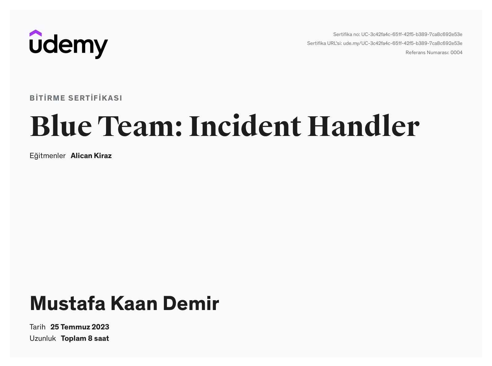
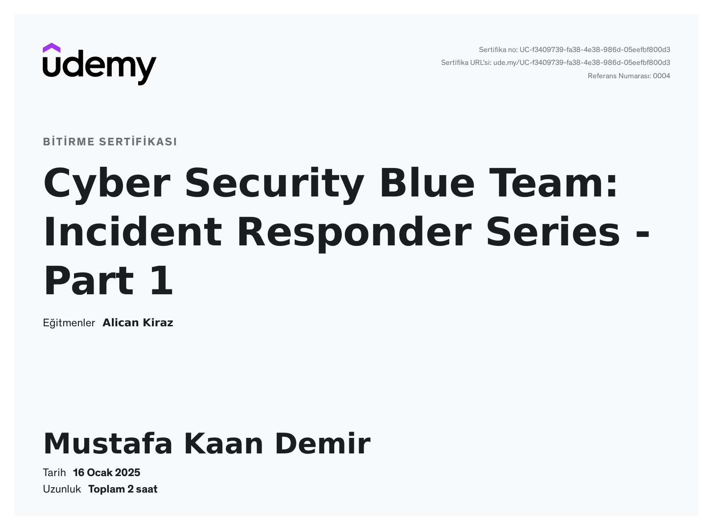

<!-- markdownlint template -->
<!-- markdownlint-disable MD033 -->

# BLUE TEAM

    

Bu repo, Blue Team üzerine çalışmalarımı ve notlarımı içermektedir.

## Table of Contents

- [BLUE TEAM](#blue-team)
  - [Table of Contents](#table-of-contents)
    - [Document](#document)
    - [Certificate](#certificate)

### Document

- [Incident Handler](<documents/Incident Handler.md>)
- [Incident Responder](<documents/Incident Responder.md>)

### Certificate

    
    

